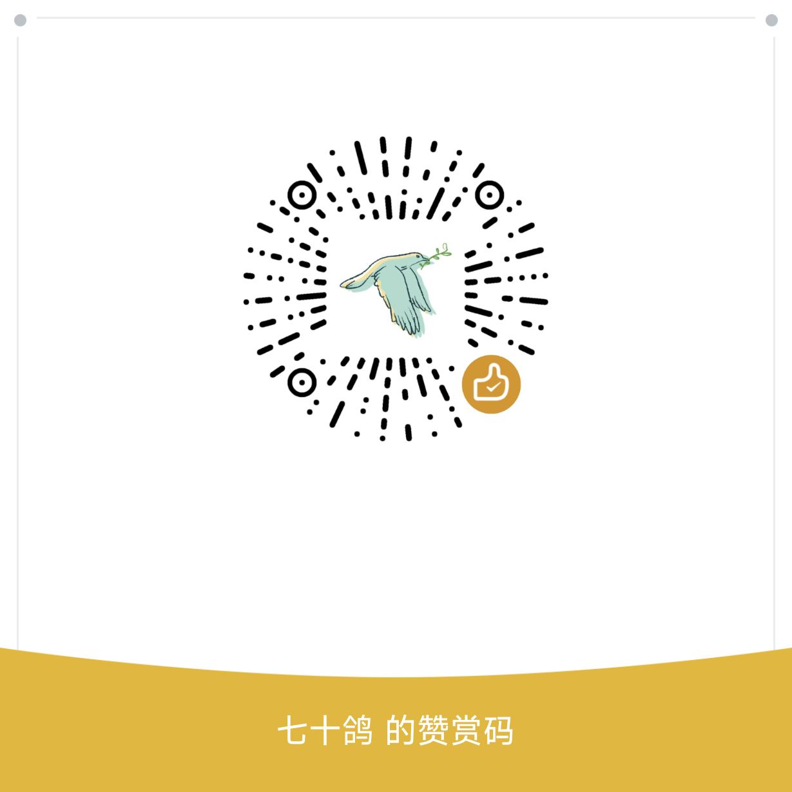

# 鸽子下载（GeZi）

> 一个 Windows 桌面端的**夸克网盘下载器** —— 支持分享链接 / 网盘直链解析、
> 多线程分片下载、边下边播、多账号管理、深色模式。
> 基于 **.NET Framework 4.8 + WPF** 开发，**零 NuGet 依赖、可完全离线构建**。

<p align="center">
  
</p>
<p align="center">
  
  
  
  
</p>

---

## ✨ 功能特性

### 下载
- **两种写入方式**
  - `共写同一文件`：所有线程写同一个文件，**省磁盘空间**（默认）
  - `独立分片 + 顺序合并`：每个分片独立文件，**可边下边播**
- **高并发分片下载**：片数按文件大小自动计算（≥ 有效并发 × 8，上限 4096）
- **连接数按文件大小比例分配**：大文件多给连接，小文件不浪费
- **暂停 / 续传**：断点续传，重启后自动恢复未完成任务
- **限速自适应**：被服务端限流时自动退避，空闲后自动恢复
- **取消即清理**：取消任务会立刻删除本地残留（想保留进度请用「暂停」）

### 解析与登录
- **分享链接解析**：支持夸克分享链接（含带口令的链接）
- **免转存直链**：文件右键可选「免转存下载」，不占用网盘空间
- **二维码识别**：分享页只给二维码图片时，可截图识别（Ctrl+V / 选文件 / 拖拽）
- **扫码登录**：内置 Python 桥完成扫码登录与账号信息获取
- **多账号**：可保存多个账号，一键切换

### 体验
- **边下边播**：未下完也能用 VLC 播放已下载部分
- **深色模式**：亮色 / 深色 / 跟随系统
- **托盘常驻 + 悬浮小窗**：关掉主窗口也继续下载
- **导出直链**：纯直链 / curl / aria2c 三种格式
- **拖拽添加**：支持拖拽链接、文件到窗口

---

## 🖥 系统要求

| 项 | 要求 |
|---|---|
| 操作系统 | **Windows 10 1903+ / Windows 11**（推荐）<br>Windows 8.1 / Windows 7 SP1 理论可用，需自行安装 .NET Framework 4.8 |
| 运行时 | **.NET Framework 4.8**（Win10 1903 起系统内置） |
| 播放器（可选） | **VLC** —— 仅边下边播功能需要 |
| 架构 | x64 |

> ⚠️ **本软件仅支持 Windows**，不支持 Linux / macOS。
> （UI 基于 WPF、运行时为 .NET Framework，两者均为 Windows 独占。）

---

## 🚀 使用

### 方式一：下载发行版（推荐）

1. 从 [Releases](https://github.com/huaotem-bot/gezi-quark-downloader/releases) 下载 `GeZi-v2.2.0-win64.zip` 并解压到任意目录
2. 双击 `GeZi.exe` 即可运行
3. 若系统缺少 .NET Framework 4.8，Windows 会弹窗提示，按引导安装即可

> 无需安装 Python —— 运行所需的精简 CPython 已内置于 `Runtime/` 目录。

### 方式二：从源码构建

```bash
# 1. 克隆仓库
git clone <仓库地址>
cd GeZi

# 2. 构建（Release）
dotnet build GeZi.slnx -c Release

# 3. 运行
src/GeZi/bin/Release/net48/GeZi.exe
```

**无需 `nuget restore`** —— 本项目零 NuGet 依赖，所有第三方库以固化 DLL 形式随仓库分发，
任何机器 clone 下来即可直接构建（需已安装 .NET Framework 4.8 开发包 / MSBuild）。

---

## 🧱 项目结构

```
GeZi/
├── src/
│   ├── GeZi/                     # 主程序（WPF 界面层）
│   │   ├── MainWindow.xaml(.cs)  # 主窗口
│   │   ├── Resources/            # 主题色、样式、图标
│   │   │   ├── Colors.Light.xaml # 亮色配色（36 个键）
│   │   │   ├── Colors.Dark.xaml  # 深色配色（与亮色键一一对应）
│   │   │   └── ...
│   │   └── ...
│   └── GeZi.Core/                # 核心逻辑（无 UI 依赖，可单独复用）
│       ├── Api/                  # 夸克 API 客户端
│       ├── Download/             # 分片下载引擎
│       ├── Support/              # 二维码编解码等工具
│       ├── lib/ZXing/            # 固化的 ZXing DLL（二维码解码）
│       └── Runtime/win-x64/      # 内置精简 CPython（扫码登录用）
├── LICENSE                       # GPL-3.0
└── THIRD-PARTY-NOTICES.md        # 第三方组件声明
```

---

## 📜 许可证

本项目以 **GNU General Public License v3.0** 发布，详见 [LICENSE](LICENSE)。

```
Copyright (C) 2026  Yi Yuan

This program is free software: you can redistribute it and/or modify
it under the terms of the GNU General Public License as published by
the Free Software Foundation, either version 3 of the License, or
(at your option) any later version.

This program is distributed in the hope that it will be useful,
but WITHOUT ANY WARRANTY; without even the implied warranty of
MERCHANTABILITY or FITNESS FOR A PARTICULAR PURPOSE.  See the
GNU General Public License for more details.
```

这意味着：你可以自由使用、修改、分发本软件，
但**任何分发（含修改版）都必须同样以 GPL-3.0 开源**，并提供完整源代码。

### 第三方组件

本项目使用了以下第三方开源组件，详见 [THIRD-PARTY-NOTICES.md](THIRD-PARTY-NOTICES.md)：

| 组件 | 许可证 |
|---|---|
| ZXing.Net | Apache-2.0 |
| CPython | PSF License |
| OpenSSL | Apache-2.0 |

---

## ⚠️ 免责声明

1. 本项目**仅供学习与技术研究**使用。
2. 本项目通过调用**夸克网盘的非公开接口**实现功能，可能随服务端变更而失效。
3. 请勿将本软件用于**商业用途**，或用于**侵犯他人版权 / 违反服务条款**的行为。
4. 使用者应自行承担因使用本软件产生的一切后果，作者不承担任何责任。
5. 下载的内容版权归原权利人所有，请遵守相关法律法规。

---

## 🙏 致谢
感谢 [ZXing.Net](https://github.com/micjahn/ZXing.Net/) 提供的二维码解码能力，
以及 [Python](https://www.python.org/) 社区。

开发过程中参考了若干开源下载器的公开文档与设计思路（未复制其源代码），
在此一并致谢，详见 [THIRD-PARTY-NOTICES.md](THIRD-PARTY-NOTICES.md) 第 5 节。

---

## ☕ 赞赏支持

如果这个项目对你有帮助，欢迎请作者喝杯咖啡 ☕

<p align="center">
  
</p>

